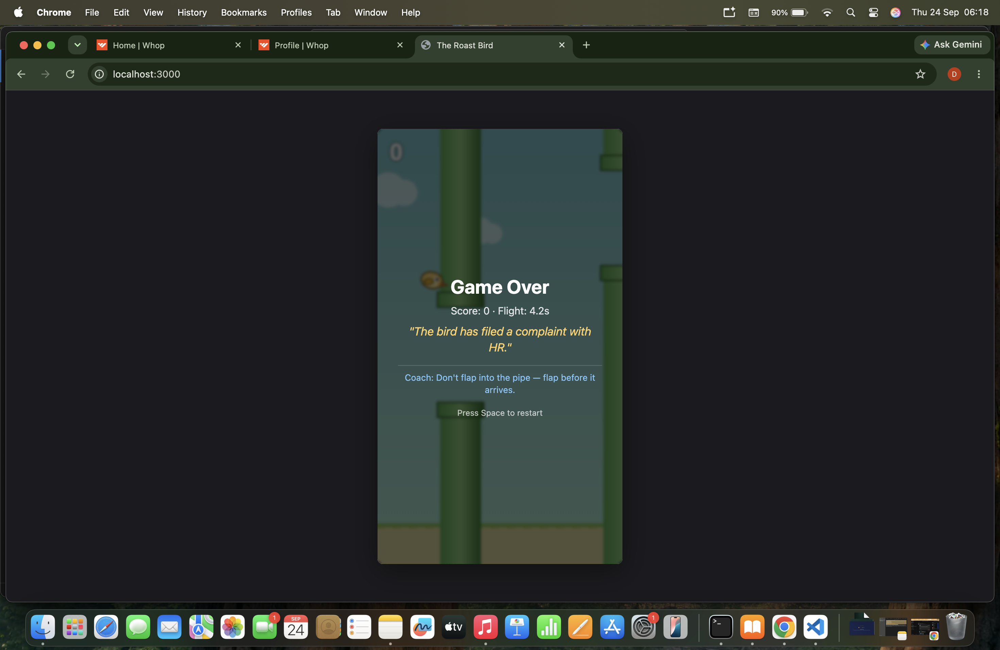

# 🦅 The Roast Bird

A Flappy Bird clone where a local LLM roasts you after every death, based on exactly how you died. All inference runs on-device via the [QVAC SDK](https://github.com/tetherto/qvac) — no API keys, no cloud, no data leaving your machine.

> *"Three pipes and a 4-second run. Impressive, in the wrong direction."*

## What it does

Every time you die, the game sends the death context (score, survival time, pipe number, flap count, attempt number) to a local Node.js server. The server runs inference through QVAC's `completion` function to generate a **roast**, and pairs it with a **coaching tip**.

- **Roast:** AI-generated, one short sentence, must cite a real stat from the death report. A server-side validator rejects roasts that garble units, repeat recent ones, or run too long — in which case a curated fallback is used instead.
- **Tip:** always curated. The 1B model is good at roasting, bad at coaching, so tips come from a hand-written set that stays useful and clean every time.

Roasts escalate in tone as you play — deadpan mockery at first, then grudging respect at higher scores.

## Built with

- **@qvac/sdk v0.20.0** — `loadModel` + `completion` for on-device inference
- **Model:** `LLAMA_3_2_1B_INST_Q4_0` (Llama 3.2 1B Instruct, Q4_0 quantized)
- Vanilla HTML5 canvas + JS (no build step)
- Node.js >= 22.17

## Prerequisites

- **Node.js >= 22.17** and **npm >= 10.9**
- **4 GB+ RAM** recommended
- **~1 GB free disk** for the model (cached in ~/.qvac/models/ after first run)
- **Windows users:** Vulkan >= 1.4 is required even for CPU-only inference

## Install

    git clone https://github.com/bigyan-codes/the-roast-bird.git
    cd the-roast-bird
    npm install

## Run

    npm start

Then open **http://localhost:3000** in your browser.

- **First run:** the model downloads (~1 GB) — you'll see progress in the top-right HUD. The game is playable during the download using canned fallback roasts.
- **Subsequent runs:** the model loads from cache in ~1 second.
- **Controls:** Space / click / tap to flap.

## Architecture

    Browser (canvas game)  --POST /api/roast-->  Node server (localhost)
                                                 |- session memory (in-RAM)
                                                 |- escalation + prompt builder
                                                 |- roast validation
                                                 |- QVAC SDK (on-device inference)

- `GET /api/status` -> model download/load progress
- `POST /api/roast` -> death context in, roast out

## License

MIT — see [LICENSE](./LICENSE).
